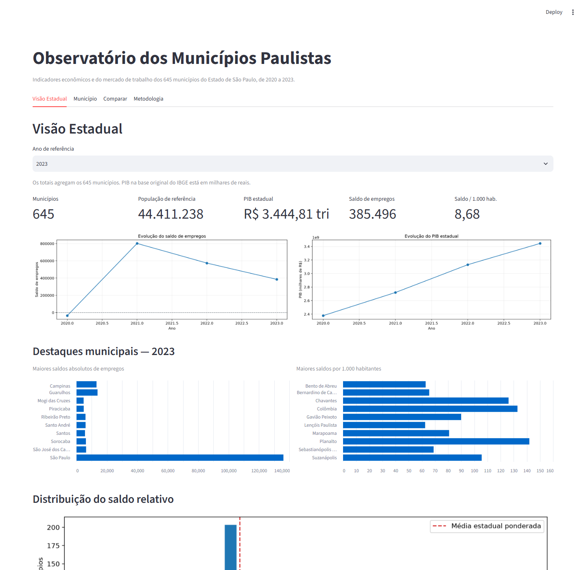
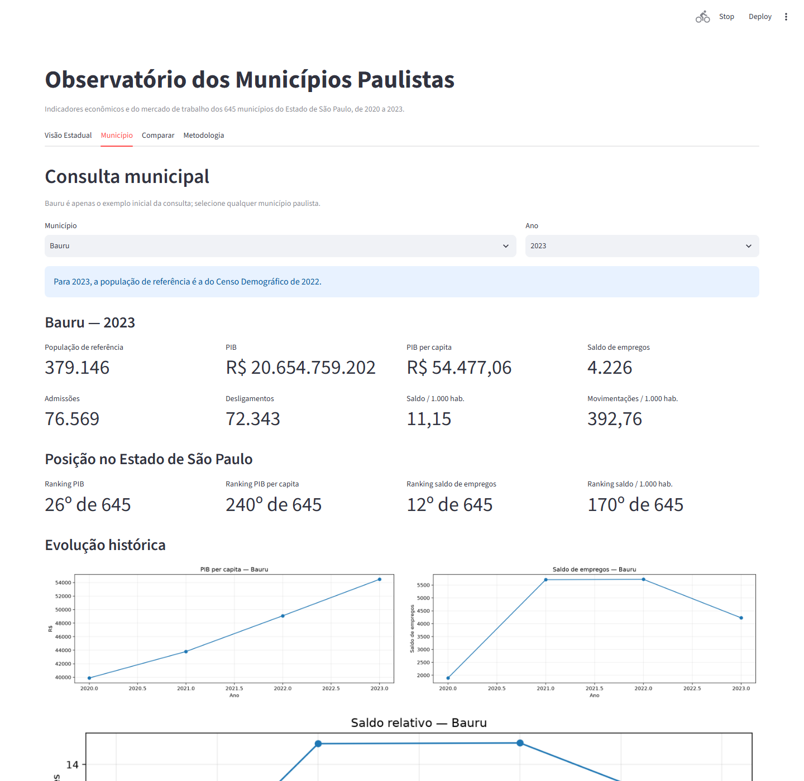
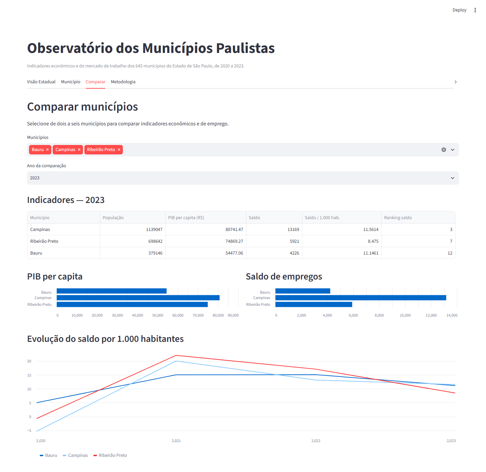
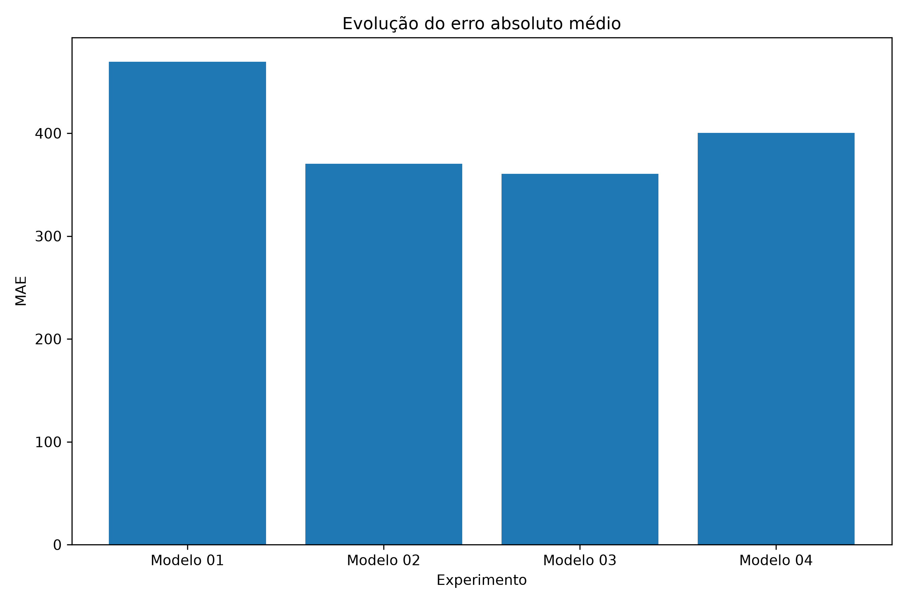

# Observatório dos Municípios Paulistas

Projeto de Ciência de Dados que integra dados públicos do **IBGE** e do **Novo CAGED** para analisar a economia e o mercado de trabalho dos **645 municípios do Estado de São Paulo**, entre **2020 e 2023**.

O resultado é um observatório interativo para consultar indicadores municipais, ver a visão consolidada do estado e comparar municípios.

> Aplicação online: publicar conforme as instruções em [Deploy](#deploy). A URL é adicionada aqui após a publicação, para não apontar para uma aplicação inexistente.

## O problema de negócio

Dados econômicos, demográficos e de emprego público costumam estar distribuídos em fontes, períodos e granularidades diferentes. Isso dificulta responder perguntas simples: quais municípios geraram mais empregos, como comparar municípios de portes distintos e quais características econômicas estão associadas às variações no emprego formal?

O projeto transforma essas fontes em um painel longitudinal na unidade **município + ano**, pronto para análise e consulta.

## Produto

O dashboard Streamlit possui quatro abas:

- **Visão Estadual:** totais e evolução dos 645 municípios, destaques e distribuição do saldo relativo;
- **Município:** indicadores, rankings, histórico, estrutura econômica e resultado do experimento para qualquer município — Bauru é apenas o exemplo inicial;
- **Comparar:** comparação de até seis municípios;
- **Metodologia:** fontes, premissas e limites de interpretação.







## CRISP-DM

O trabalho foi estruturado com base no CRISP-DM:

1. **Business Understanding:** definir as perguntas sobre dinâmica econômica e geração de empregos formais.
2. **Data Understanding:** avaliar cobertura, granularidade e limitações das bases públicas.
3. **Data Preparation:** extrair, padronizar e integrar IBGE e Novo CAGED; criar indicadores normalizados e defasagens temporais.
4. **Modeling:** executar quatro experimentos de Machine Learning com divisão temporal.
5. **Evaluation:** comparar métricas, interpretar variáveis, avaliar resíduos e investigar heterogeneidade por porte municipal.
6. **Deployment:** disponibilizar a análise no dashboard interativo.

## Fontes de dados

| Fonte | Uso no projeto |
|---|---|
| [IBGE](https://www.ibge.gov.br/) | códigos municipais, população, PIB, PIB per capita e componentes do Valor Adicionado Bruto |
| [Novo CAGED](https://www.gov.br/trabalho-e-emprego/) | admissões, desligamentos e saldo de empregos formais |

Os microdados mensais do Novo CAGED são agregados por município e ano. Os componentes setoriais do VAB disponíveis nesta versão da base cobrem 2020 e 2021; eles não foram imputados para anos sem divulgação equivalente.

## Pipeline de dados

```text
IBGE + Novo CAGED
        ↓
extração e padronização de municípios
        ↓
agregação do CAGED: admissões, desligamentos e saldo
        ↓
integração com PIB, população e estrutura econômica
        ↓
engenharia de atributos, normalização e rankings
        ↓
base_observatorio_sp.csv
        ↓
EDA, modelagem, avaliação e dashboard
```

O painel final contém 2.580 observações: 645 municípios × 4 anos (2020–2023).

## Análise exploratória e engenharia de atributos

A EDA investigou distribuição dos saldos, escala populacional, PIB per capita, comportamento por porte e casos extremos. Para permitir comparações mais justas entre municípios, foram construídos indicadores como:

- admissões, desligamentos e saldo por 1.000 habitantes;
- movimentações por 1.000 habitantes;
- crescimento de PIB e PIB per capita;
- rankings estaduais;
- variáveis defasadas de emprego;
- participação setorial e setor dominante, quando disponível.

Normalizar o emprego por população foi essencial: números absolutos são fortemente influenciados pelo porte do município.

## Modelagem: experimentos 01–04

Os modelos usam validação temporal e devem ser lidos como experimentos analíticos, não como previsão operacional.

| Experimento | Algoritmo | MAE | RMSE | R² | Principal contribuição |
|---|---:|---:|---:|---:|---|
| Modelo 01 | Baseline: saldo anterior | 469,49 | 2.864,61 | 0,7247 | referência inicial |
| Modelo 02 | Ridge | 370,15 | 2.075,79 | 0,8554 | feature engineering temporal |
| **Modelo 03** | **Random Forest** | **360,66** | **1.347,27** | **0,9391** | normalização populacional |
| Modelo 04 | Random Forest | 400,23 | 2.040,67 | 0,8603 | estrutura econômica defasada |

O **Modelo 03** é o principal experimento do projeto. Comparado ao baseline, ele reduziu o MAE de 469,49 para 360,66 — uma redução de **23,18%**.



## Análise de resíduos e análise setorial

O R² agregado de 0,9391 do Modelo 03 não foi tratado como “94% de precisão”. A análise de resíduos mostrou que o resultado agregado é influenciado pelos municípios de maior porte e que o erro não é homogêneo entre faixas populacionais. Essa etapa orienta uma interpretação responsável do modelo.

Também foi realizada análise setorial para investigar a associação entre a estrutura econômica municipal e a recuperação do emprego. Os resultados são apresentados como evidência exploratória: não estabelecem causalidade.

## Limitações

- O painel cobre 2020–2023; não representa séries anteriores ou posteriores.
- Os indicadores por 1.000 habitantes dependem da população de referência disponível; em 2023, usa-se o Censo 2022.
- Dados setoriais equivalentes não estão disponíveis para todos os anos nesta versão.
- Resultados de correlação, importância de variáveis e Machine Learning não implicam causalidade.
- O Modelo 03 é um experimento avaliado no recorte do projeto, não um modelo de previsão em produção.

## Como executar

Pré-requisito: Python 3.11 ou superior.

```bash
git clone https://github.com/pedrokamerli/observatorio_municipios_sp.git
cd observatorio_municipios_sp
python -m venv .venv
```

No Windows:

```powershell
.venv\Scripts\Activate.ps1
pip install -r requirements.txt
streamlit run src/dashboard/app.py
```

No macOS/Linux:

```bash
source .venv/bin/activate
pip install -r requirements.txt
streamlit run src/dashboard/app.py
```

Abra `http://localhost:8501`. A base leve necessária ao dashboard, `data/processed/base_observatorio_sp.csv`, é versionada; os microdados brutos não são incluídos no repositório.

## Deploy

Para publicar no Streamlit Community Cloud:

1. envie as alterações para o GitHub;
2. em [share.streamlit.io](https://share.streamlit.io/), selecione o repositório;
3. informe `src/dashboard/app.py` como arquivo principal;
4. após a publicação, substitua o aviso do topo deste README pela URL gerada.

Em uma VPS, instale as dependências e execute `streamlit run src/dashboard/app.py --server.address 0.0.0.0`; use um proxy reverso com HTTPS para expor o serviço.

## Estrutura do repositório

```text
src/
  extract/       # coleta das fontes públicas
  transform/     # integração e criação das bases analíticas
  analysis/      # EDA, resíduos, análise setorial e comparação de modelos
  modeling/      # experimentos 01–04
  dashboard/     # aplicação Streamlit
data/
  raw/           # somente local; microdados ignorados pelo Git
  processed/     # bases intermediárias locais + base leve do dashboard
outputs/         # tabelas e gráficos das análises
docs/images/     # imagens exibidas neste README
```

## Tecnologias

Python, Pandas, NumPy, Scikit-learn, Matplotlib, Streamlit, APIs públicas, Git e GitHub.
